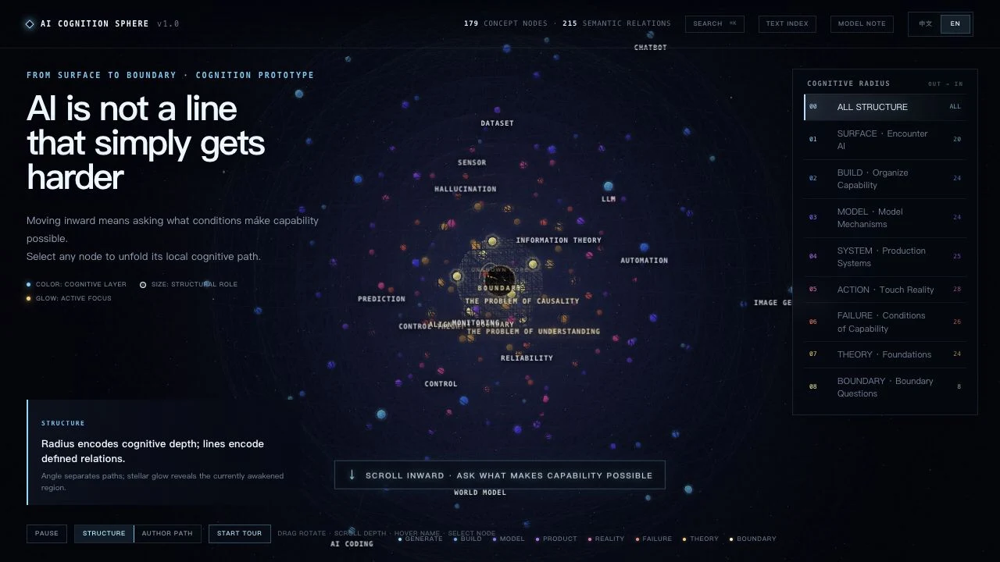
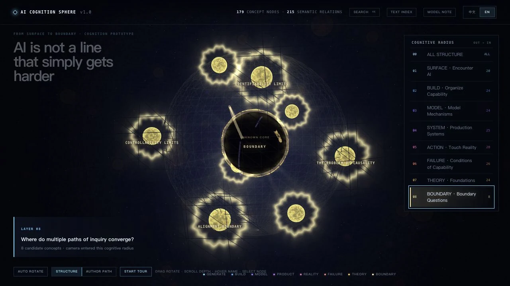
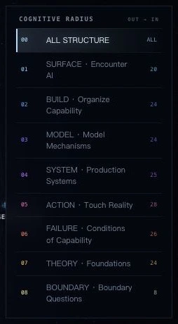
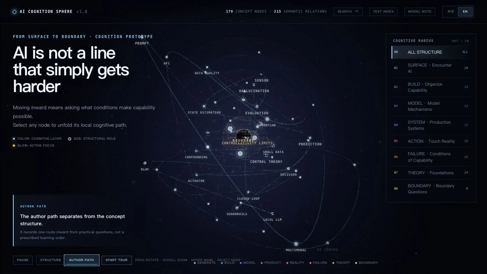
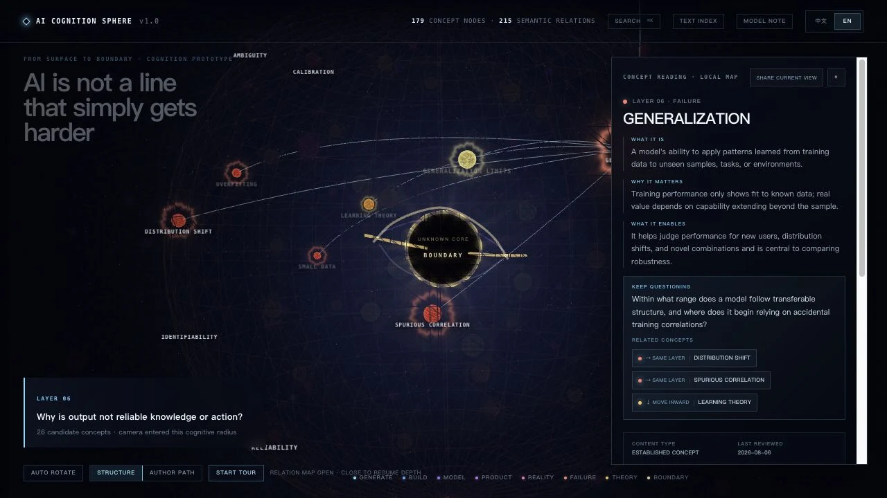

**English** | [简体中文](README.zh-CN.md)

# AI Cognition Sphere

> AI is not a line that simply gets harder.

An AI cognition map you can enter. It begins with visible capabilities, then moves inward through models, systems, real-world action, failure conditions, foundational theory, and questions that remain unresolved at the boundary.

[Enter the 3D sphere](https://ai-cognition-sphere.ai-cognition-sphere.workers.dev) · [Open the readable index](https://ai-cognition-sphere.ai-cognition-sphere.workers.dev/read) · **[Download the offline edition](https://github.com/dalaofei1154/ai-cognition-sphere/releases/download/v1.0.0/AI-Cognition-Sphere-v1.0.0-Universal-Offline.zip)** · [View the v1.0.0 release](https://github.com/dalaofei1154/ai-cognition-sphere/releases/tag/v1.0.0)



### Use it offline

Download and extract `AI-Cognition-Sphere-v1.0.0-Universal-Offline.zip`, then open `AI-Cognition-Sphere-v1.0.0.html` in a current desktop browser. The same package works on Windows and macOS without installation, Node.js, or a network connection. The repository's **Code → Download ZIP** option contains the source code; use the offline-edition link above for the ready-to-open version.

## Why this sphere exists

I once tried to connect a language model to a system that interacted with a physical device.

At first, I was thinking about prompts, sensors, and control logic. Once the model began to affect the physical world, however, the questions changed quickly. Did it have enough information? Had it understood the person's intent? Could its judgment be trusted? If it was wrong, would the consequences be acceptable?

The model's judgments were probabilistic. The device's actions were real, and some of their consequences could not be undone.

More sensors, rules, follow-up questions, and human confirmation could reduce the risk, but every safeguard introduced another cost. In this experiment, the cost of confirming intent eventually exceeded the value of the action itself. I removed the language model from the core control path and ended the experiment.

The experiment stopped, but one question remained:

> What lies between a capability that appears to work and one that can be relied on in the real world?

This sphere grew from that question. The original device is not shown, and details tied to personal identity have been removed. What remains is the path of questions that kept moving inward.

## How the sphere encodes a cognitive structure

The sphere is not decoration. It is the structure of the model itself.

- **Radius** moves inward toward the conditions under which a capability holds. It does not represent rank or value.
- **Angle** separates branches of inquiry. It does not impose a fixed sequence.
- **Color** distinguishes the eight cognitive layers.
- **Size** suggests a node's structural role, not its importance.
- **Lines** represent explicitly defined semantic relations.
- **Glow** marks regions that are active, attended to, or traversed.
- **The dark core** is reserved for questions that remain unknown and cannot be fully illuminated.



*Radius, color, scale, relations, and glow work together to describe each node. The dark core is kept for what remains unresolved.*

From the outside inward, the eight layers are:

1. Surface — Encounter AI
2. Build — Organize Capability
3. Model — Model Mechanisms
4. System — Production Systems
5. Action — Touch Reality
6. Failure — Conditions of Capability
7. Theory — Foundations
8. Boundary — Unresolved Questions

<p align="center">
  
</p>

This is a cognitive model shaped by practical experience, not the one correct way to classify AI.

## What the work contains

- **179 concept nodes** spanning visible capabilities, building methods, model mechanisms, production systems, real-world action, failure conditions, foundational theory, and cognitive boundaries.
- **8 cognitive radii** that move toward conditions of validity, not from beginner to advanced.
- **215 semantic relations** connecting adjacent concepts and questions.
- **A 50-node author path** shaped by one real project experience. It is not a recommended learning path.
- **A deterministic tour of about 60 seconds** that unfolds along the author path.
- **Bilingual content and sources** for every node: definition, authorial interpretation, practical significance, a question to carry forward, editorial status, review date, and references.
- **A readable index** containing every node and source without requiring WebGL.
- **Shareable state** for concepts, views, layers, and language through the URL.



*The author path lets one route through the structure come into view. It is a record of practice, not a prescribed order of study.*



*Every node can be opened to reveal its definition, interpretation, next question, editorial status, references, and local relations.*

## Where to begin

On your first visit, stay at the surface for a few seconds and take in the scale of the whole sphere.

Then scroll inward. You do not need to understand every concept. Simply notice how the questions shift from “What can AI do?” to “Under what conditions can these capabilities hold?”

If you have built an AI project, open **Author Path** and see whether you recognize any of its turning points.

If you only want to find and read material, use search or go directly to the [readable index](https://ai-cognition-sphere.ai-cognition-sphere.workers.dev/read).

## The boundaries of this map

This is not an encyclopedia that attempts to exhaust the field of AI.

The eight-layer structure is neither the only valid classification nor a learning sequence from elementary to advanced. The author path records one person's experience and does not stand for every way of understanding AI.

The interface distinguishes established concepts, authorial interpretations, and boundary propositions. References support definitions and traceability; they do not imply that every authorial judgment is an academic consensus.

## Why it is open source

I want AI Cognition Sphere to offer, first of all, a sense of direction.

For someone just beginning to explore AI, this is not a standard curriculum but a map that can be seen from a distance. Today's tools and visible capabilities are only the surface. Farther inward are models, systems, actions in the physical world, failure conditions, foundational theory, and questions that remain open at the boundary.

You do not need to understand the entire map at once. It is already useful to see that these questions exist and to gain a rough sense of where you are standing.

For people who have gone deeply into a particular direction, I hope the map can become a place to share experience and disagreement. Your path might begin with code, products, research, art, robotics, or philosophy. It might look nothing like mine.

No single person can draw a complete map of AI. I am opening the project so this structure can be inspected, challenged, and extended.

Its growth should not be measured only by the number of nodes. The concepts should become more precise, the relations more trustworthy, different paths easier to see, and the unknown boundary more honestly preserved.

> Give those who are setting out a sense of direction, and let those who have travelled farther leave their own signposts.

## Contribute your path

If your work with, construction of, or research into AI has led you to a different understanding, you are welcome to share your path:

- Where did you begin?
- Which questions did you pass through?
- When did your judgment change?
- Where did you finally encounter a boundary?

You can also correct a concept, add a source, or propose a different relation between concepts.

Open sourcing this project is not an attempt to make everyone accept the same map. It is an attempt to make different experiences visible, comparable, and discussable.

`v1.0` presents only the author path. New paths and structural proposals can begin as content proposals; see [CONTRIBUTING.md](CONTRIBUTING.md) for the current process.

Contributors may use AI tools, but remain responsible for the accuracy, sourcing, and licensing of their submissions. Large batches of AI-generated material will not be merged without line-by-line review.

## Code and structure

The project keeps its cognitive content, 3D scene, and interface state separate:

- `app/cognition-model.ts` — cognitive layers, concept nodes, and semantic relations.
- `app/concept-notes.ts` — concept explanations, editorial status, and questions to carry forward.
- `app/concept-sources.ts` — reference sources.
- `app/cognition-tour.ts` — the author path and deterministic tour.
- `app/use-sphere-scene.ts` — 3D scene, camera, and animation lifecycle.
- `app/sphere-experience.tsx` — interface state and interaction entry points.
- `app/readable-index.tsx` and `app/read/` — the readable index, sharing the same content model as the sphere.

This separation allows the cognitive structure to be reviewed independently, the visual implementation to evolve, and the complete content to remain readable without WebGL.

## Current version

`v1.0.0` is the first public baseline of the work.

The primary experience is designed for a large desktop browser. It is an interactive authored work first, while also providing a readable index, a universal offline edition, and automated verification.

## Run locally

Requires Node.js `^22.13.0` or `>=24`.

```bash
npm ci
npm run dev
```

Run the complete verification suite:

```bash
npm run verify
```

Verification includes linting, type checking, a production build, artifact validation, standalone offline builds, and automated tests.

Build the self-contained sphere and readable index:

```bash
npm run build:offline
```

Assemble the universal offline release folder:

```bash
npm run package:offline
```

## Author and AI collaboration

AI Cognition Sphere was initiated, designed, and is maintained by [Flynn](https://github.com/dalaofei1154).

AI assisted with concept organization, source checking, code collaboration, and language editing. The author remains responsible for the structural choices, author path, editorial judgments, and final publication.

## License

- Software code is released under the [MIT License](LICENSES/MIT.txt).
- Original concept arrangement, writing, and visual content are released under [CC BY 4.0](LICENSES/CC-BY-4.0.txt).
- “AI Cognition Sphere,” “AI 认知边界球体,” and the project marks remain reserved to the author; see [TRADEMARKS.md](TRADEMARKS.md).

See [LICENSE.md](LICENSE.md) for the full licensing boundary and [CONTRIBUTING.md](CONTRIBUTING.md) for contribution terms.
