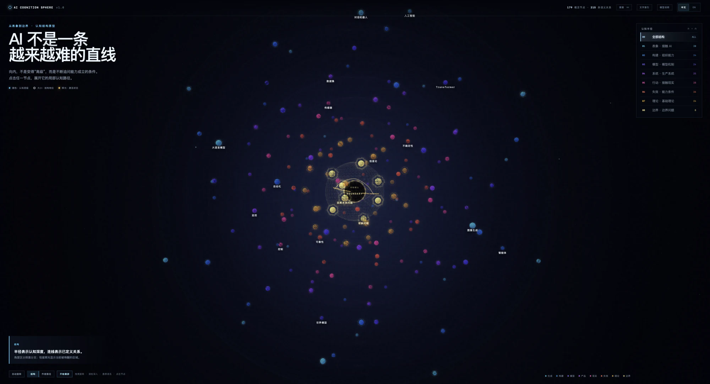
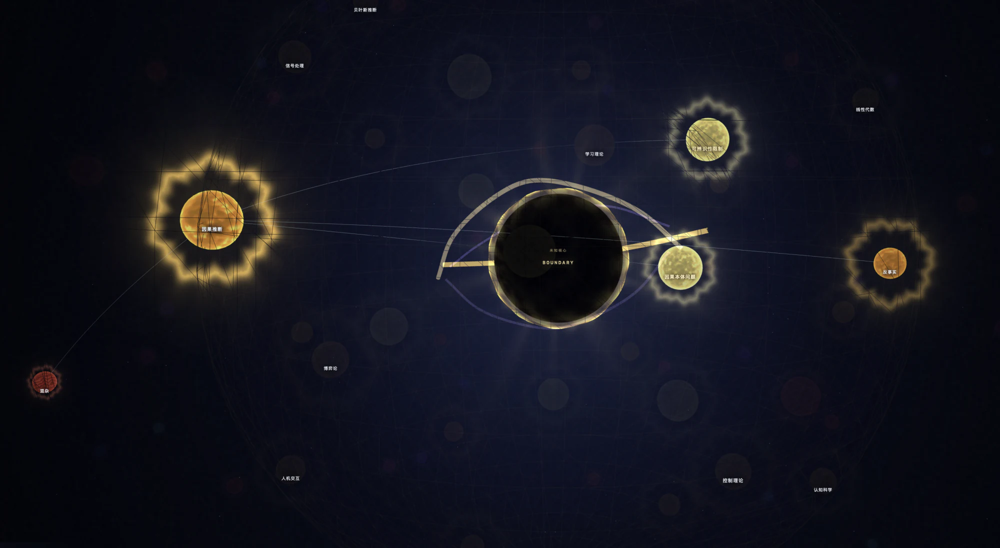
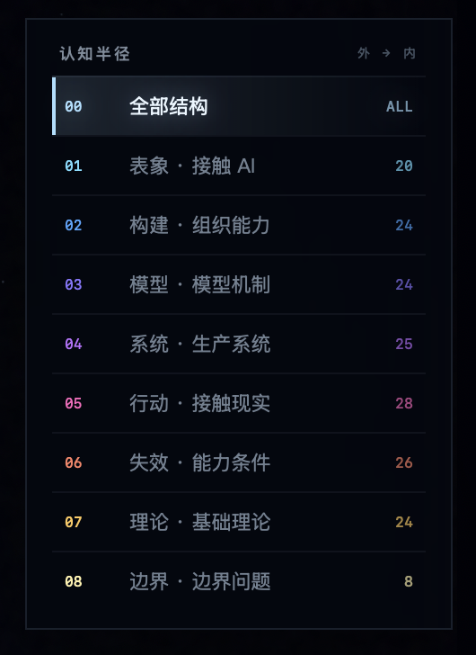
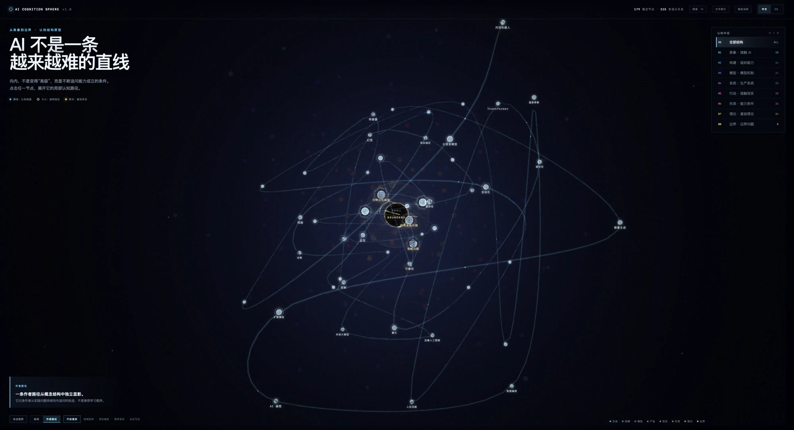
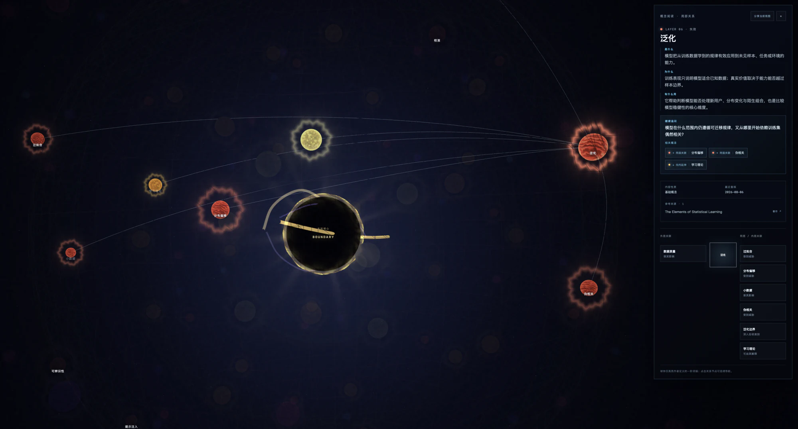

[English](README.md) | **简体中文**

# AI Cognition Sphere

## AI 认知边界球体

> AI 不是一条越来越难的直线。

一个可以进入的 AI 认知地图：从可见能力出发，逐渐走向模型、系统、现实行动、失效条件、基础理论与尚未解决的边界问题。

[进入三维球体](https://ai-cognition-sphere.ai-cognition-sphere.workers.dev/?lang=zh) · [打开文字索引](https://ai-cognition-sphere.ai-cognition-sphere.workers.dev/read?lang=zh)



## 为什么会有这颗球

我曾尝试把语言模型接入一个与物理设备联动的系统。

最开始，我关心的是提示词、传感器和控制逻辑。但当模型真的开始影响现实，问题很快变了：信息够不够？模型有没有理解人的意图？它的判断能不能被信任？如果判断错了，后果是否能够承受？

模型给出的判断带有概率性，设备的动作却会产生真实、甚至不可逆的后果。

增加传感器、规则、追问和人工确认可以降低风险，但每一层补丁也会增加新的成本。在这次实验中，当确认意图的成本开始超过动作本身的价值，我最终让语言模型退出了核心控制路径，也停止了实验。

实验停了，问题却留了下来：

> 一个能力看起来“能做”，和它在现实中可靠成立，中间到底还缺什么？

这颗球就是从这个问题开始的。我没有展示原来的设备，也删去了与身份有关的细节，只留下那条不断向内追问的路径。

## 这颗球如何表达认知结构

球体不是装饰，而是这套认知结构本身。

- **半径**表示问题逐渐向成立条件深入，不代表知识等级或价值高低。
- **角度**用于分开不同的探索分支，不表示固定顺序。
- **颜色**区分八个认知层。
- **大小**提示节点在结构中的角色，不代表重要性排名。
- **连线**表示经过定义的语义关系。
- **发光**表示当前被唤醒、关注或经过的区域。
- **中央暗核**保留给仍然未知、无法被完全照亮的问题。



*节点由半径、颜色、大小、连线和发光状态共同表达；中央暗核保留给仍未解决的问题。*

从外向内，八层结构依次是：

1. 表象：接触 AI
2. 构建：组织能力
3. 模型：模型机制
4. 系统：生产系统
5. 行动：接触现实
6. 失效：能力成立的条件
7. 理论：基础理论
8. 边界：尚未解决的问题

<p align="center">
  
</p>

这是一种由实践经历形成的认知模型，不是唯一正确的 AI 分类体系。

## 作品包含什么

- **179 个概念节点**：从可见能力、构建方法、模型机制和生产系统，深入到现实行动、失效条件、基础理论与认知边界。
- **8 层认知半径**：表示问题向成立条件深入，不代表从简单到高级的学习等级。
- **215 条语义关系**：连接彼此相关的问题与概念。
- **50 节点作者路径**：由一次真实项目经历形成，不是推荐学习路线。
- **约 60 秒认知漫游**：沿作者路径展开的一段自动空间叙事。
- **双语内容与来源**：每个节点包含定义、作者解释、实际意义、继续追问、内容状态、复核日期与参考来源。
- **文字索引**：不依赖 WebGL，也能完整阅读全部节点和来源。
- **可分享状态**：概念、视图、层级和语言可以保留在 URL 中。



*作者路径记录概念结构中独立显影的一条实践路线，不是推荐学习顺序。*



*每个节点都可以继续展开，阅读定义、作者解释、延伸问题、内容状态与参考来源。*

## 从哪里开始

第一次进入时，可以先停留几秒，感受整颗球的规模。

然后向内滚动。不要急着理解所有概念，只需要观察问题如何从“AI 能做什么”逐渐转向“这些能力凭什么成立”。

如果你做过 AI 项目，可以打开“作者路径”，看看自己是否也经历过相似的转折。

如果你只想查找和阅读内容，可以使用搜索，或者直接进入[文字索引](https://ai-cognition-sphere.ai-cognition-sphere.workers.dev/read?lang=zh)。

## 这张地图的边界

它不是试图穷尽 AI 知识的百科。

八层结构不是唯一正确的概念分类，也不是从初级到高级的学习顺序。作者路径只记录了一段个人实践经历，不代表所有人理解 AI 的方式。

界面会区分基础概念、作者解释和边界命题。来源用于支持定义和追溯，但不意味着所有作者判断都已经成为学术共识。

## 为什么开源

我希望 AI Cognition Sphere 首先能提供一点方向感。

对刚开始接触 AI 的人，它不是一条标准学习路线，而是一张可以远观的地图：眼前的工具和可见能力只是表层，向内还有模型、系统、现实行动、失效条件、基础理论，以及尚未解决的边界问题。

你不需要一次理解全部内容。先看见这些问题存在，知道自己大概站在哪里，就已经有意义。

对已经在某个方向深入实践的人，我希望这张地图成为分享分歧和经验的地方。你的路径可能从代码、产品、研究、艺术、机器人或哲学开始，也可能与我的经历完全不同。

一个人无法画完 AI 的完整地图。选择开源，是希望这份结构能够被检查、质疑和继续拓展。

它的成长不应该只是节点越来越多，而应该是概念更准确、关系更可靠、不同路径更容易被看见，未知的边界也被更诚实地保留下来。

> 让刚刚出发的人获得一点方向，也让已经走得很远的人留下自己的路标。

## 贡献你的路径

如果你在使用、构建或研究 AI 的过程中形成了不同的理解，欢迎分享自己的路径：

- 你从哪里开始？
- 经过了哪些问题？
- 什么时候改变了判断？
- 最后在哪里遇到了边界？

你也可以纠正概念、补充来源，或者提出不同的概念关系。

这个项目的开源，不是希望所有人接受同一幅地图，而是希望不同经验能够被看见、比较和讨论。

`v1.0` 目前只呈现作者路径。新的路径和结构建议可以先通过内容提案提交，具体方式见 [CONTRIBUTING.md](CONTRIBUTING.md)。

贡献者可以使用 AI 工具，但需要对提交内容的准确性、来源和许可负责。未经逐条核对的大批量 AI 生成内容不会被直接合并。

## 代码与结构

项目将认知内容、三维场景和界面交互分开组织：

- `app/cognition-model.ts`：认知层、概念节点与语义关系。
- `app/concept-notes.ts`：概念解释、状态与延伸问题。
- `app/concept-sources.ts`：参考来源。
- `app/cognition-tour.ts`：作者路径与确定性漫游。
- `app/use-sphere-scene.ts`：三维场景、相机与动画生命周期。
- `app/sphere-experience.tsx`：界面状态与交互入口。
- `app/readable-index.tsx` 与 `app/read/`：与三维场景共享内容数据的文字索引。

这种分离使认知结构可以独立核对，视觉实现可以继续迭代，完整内容也不会依赖 WebGL 才能阅读。

## 当前版本

`v1.0.0` 是这件作品的第一个公开基线。

当前版本以桌面大屏浏览器为主要体验环境。它首先是一件交互式作者作品，同时也提供可阅读索引、通用离线版与自动化验证。

## 本地运行

需要 Node.js `^22.13.0` 或 `>=24`。

```bash
npm ci
npm run dev
```

执行完整验证：

```bash
npm run verify
```

验证过程包括代码规范、类型检查、生产构建、产物校验和自动化测试。

生成可直接打开的球体与文字索引 HTML：

```bash
npm run build:offline
```

组装通用离线发行目录：

```bash
npm run package:offline
```

## 作者与 AI 协作

AI Cognition Sphere 由 [Flynn](https://github.com/dalaofei1154) 发起、设计和维护。

AI 参与了概念整理、资料核对、代码协作和语言校对。作品的结构选择、作者路径、内容判断与最终发布责任由作者承担。

## 许可

- 软件代码采用 [MIT License](LICENSES/MIT.txt)。
- 原创概念编排、文字与视觉内容采用 [CC BY 4.0](LICENSES/CC-BY-4.0.txt)。
- “AI Cognition Sphere”“AI 认知边界球体”及项目标识保留作者权利，详见 [TRADEMARKS.md](TRADEMARKS.md)。

完整许可边界见 [LICENSE.md](LICENSE.md)，贡献说明见 [CONTRIBUTING.md](CONTRIBUTING.md)。
